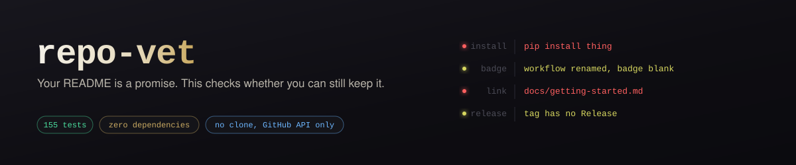
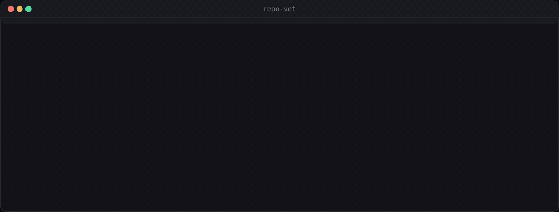

# repo-vet

**Your README is a promise. This checks whether you can still keep it.**

[](https://github.com/Furkiozknn/repo-vet/actions/workflows/ci.yml)
[](https://github.com/Furkiozknn/repo-vet/releases/latest)
[](https://www.python.org/)
[](LICENSE)
[](pyproject.toml)



<sub>One real run, three repositories that are not mine to fix. <code>tiangolo/fastapi</code>'s README links to <code>tutorial/</code>, which 404s on GitHub — reported as a warning, because on the documentation site it is a live route and that is the author's call. The other two answer every check.</sub>

`pip install thing` promises the distribution exists. A workflow badge promises
the workflow exists and has run. A relative link promises the file is in the
tree. A tag promises a release. These promises rot quietly, because the only
way to notice is to try them — and nobody tries their own README twice.

`repo-vet` tries them, over the GitHub API, without cloning anything.

```console
$ repo-vet Furkiozknn/prompt-template-manager Furkiozknn/Furkiozknn
Furkiozknn/prompt-template-manager  1 finding, 0 of them errors

Release chain
  ! `pyproject.toml` declares version 0.1.0, but the repository has never been tagged.
      pyproject.toml -> 0.1.0, tags -> none

Furkiozknn/Furkiozknn  clean (6 checks)
```

That is real output, not a mock-up (re-run on 25 September 2026).

**Try it on your own repository** — nothing to install but `uv`, and no
token needed for a public repository:

```bash
uvx --from git+https://github.com/Furkiozknn/repo-vet repo-vet OWNER/NAME
```

Exit code `0` means every check that ran passed, `1` means an error-level
finding, `3` means the repository could not be read — [the full table](#use-it).

## Status

| | |
|---|---|
| Version | 0.2.0 on `main`; latest tag [`v0.1.0`](https://github.com/Furkiozknn/repo-vet/releases/tag/v0.1.0) |
| Python | 3.9 – 3.14 |
| Runtime dependencies | none |
| Tests | 155, offline |
| Checked against | 29 public repositories ([`corpus.txt`](corpus.txt)) |
| Licence | MIT |

## What it checks

| Check | The promise | How it is broken |
|---|---|---|
| `install` | the install command in a fenced code block resolves | a distribution renamed, never published, or published under another name |
| `links` | relative links and images exist in the tree | a file moved and the link stayed |
| `badges` | a status badge points at a workflow that exists and has run | a renamed workflow makes the badge render *"no status"*, not red |
| `release` | the release chain finished | a finished version is declared but nothing was ever tagged; the tag carrying the declared version has no Release while other tags do |
| `web` | outbound links still answer | 404 and 410 only — a 403 means a host declined to talk to a script, which says nothing |
| `pages` | the advertised site is alive, and a live site is advertised | a dead homepage, or a live GitHub Pages site nobody is told about |

**Errors fail a build; warnings do not.** A link to a missing *file* is an
error — the file is gone. A link to `tutorial/` is a warning: on GitHub it
404s, but it is usually a route on a documentation site that shares this
README, and that is the author's call to make, not a linter's.

Two rules run through all of them.

**Prose is not an instruction.** A sentence that mentions `pip install thing`
is discussing it; the same line inside a fenced code block is asking you to
paste it into a terminal. Only the second is a promise. This distinction exists because
its absence produced a false positive on the first day.

**Unreachable is not broken.** A host that times out, rate-limits, or refuses a
script is not a dead link, and reporting it as one would make every other
finding less believable. The same applies upward: if PyPI cannot be reached,
the install check says nothing rather than announcing a distribution as
unpublished; if GitHub truncates a tree — `torvalds/linux` comes back with
71,638 paths and a flag saying there are more — the link and badge checks step
aside instead of calling good files missing; if the README, a manifest or the
tag list cannot be read, the check that needed it is listed as not checked
rather than counted as passed. Anything unseen is reported as *not checked*,
never as clean.

## Checked against repositories that disagree with each other

A linter is only worth running if a clean result means something. These are
the twenty-nine repositories in [`corpus.txt`](corpus.txt) — Python, Rust, Go and
TypeScript, monorepos and single crates, documentation repositories with no
code, a tree too large for GitHub to return whole:

```bash
repo-vet --from-file corpus.txt --skip web
```

On 22 September 2026 that produced **four findings across twenty-nine
repositories, one of them an error**, and each one was checked by hand:

| Repository | Finding | Verified |
|---|---|---|
| `axios/axios` | badge points at `ci.yml` | the workflow is `run-ci.yml`; the badge renders *"no status"* |
| `tiangolo/fastapi` | `tutorial/` is not in the tree | true on GitHub; it is a route on the documentation site |
| `sindresorhus/awesome` | Pages site live, homepage field empty | both true |
| `Furkiozknn/repo-vet` | declares 0.1.0, never tagged | true, and this repository's own (tagged `v0.1.0` the same day) |

Three rules exist because a repository in that list disproved the general
version: "the newest tag" (the tags API returned `v0.1.16` as the newest tag
of `fastapi`), "a declared version should be tagged" (`flask` declares
`3.2.0.dev` between releases, which is Tuesday, not a defect), and "a
relative link must exist" (`fastapi` again). Each is now a named test.

## Install

`repo-vet` is **not on PyPI yet**, so install it from this repository — both of
these work today:

```bash
# Run it without installing anything:
uvx --from git+https://github.com/Furkiozknn/repo-vet repo-vet --help

# Or install the command itself:
uv tool install git+https://github.com/Furkiozknn/repo-vet
repo-vet Furkiozknn/repo-vet
```

Once the distribution is published, `pip install repo-vet` will be the shorter
route. Until then that command fails, which is exactly the kind of thing this
tool exists to catch, so it is not written above as if it worked.

## Use it

```bash
repo-vet OWNER/NAME [OWNER/NAME ...]

repo-vet psf/requests --skip web          # skip the slow outbound-link pass
repo-vet OWNER/NAME --only install,links  # just the two that break most often
repo-vet OWNER/NAME --json                # machine-readable
repo-vet OWNER/NAME --markdown            # a GitHub step summary
repo-vet OWNER/NAME --json-out r.json --markdown   # both, from one scan
repo-vet OWNER/NAME --ref my-branch       # read the README on a branch, tag or commit
```

A token is optional for public repositories. `--token`, `GITHUB_TOKEN` or
`GH_TOKEN` raises the rate limit and reaches private repositories. Without one
GitHub allows 60 API requests an hour, and a repository costs five to seven of
them (measured on three repositories with `--skip web`), so a `--from-file`
list will want a token. When a limit is hit, the report says which one and
when it resets; a token GitHub rejects is named as such rather than passed off
as a missing repository. A GitHub request that times out or gets a 5xx is
asked once more; outbound links never are.

| Exit code | Meaning |
|---|---|
| `0` | nothing to report (warnings alone never fail a run — `--fail-on any` if you want them to) |
| `1` | findings, as `--fail-on` defines them |
| `2` | bad usage: an unknown check, a malformed slug or ref, an unreadable `--from-file` |
| `3` | a repository could not be read at all — a mistyped slug, a ref that does not exist, a rate limit, a rejected token — or nothing the requested checks needed could be read. It has no findings because nothing was looked at, and that is not the same as clean |

`--fail-on none` exits `0` in every case except bad usage.

## Use it in CI

```yaml
permissions:
  contents: read
steps:
  - uses: Furkiozknn/repo-vet@main   # or pin a release tag or a commit SHA
    with:
      fail-on: error
```

The action writes the findings into the job summary and installs the tool from
its own checkout into a venv under `RUNNER_TEMP`, so the version you pin is the
version that runs and your job's own Python is left alone. This repository's
own CI does exactly this, against itself — and checks that a repository that
does not exist turns the step red.

When it checks the repository the workflow runs in, it reads the README **at
the commit being tested**, so on a pull request it vets the pull request, not
`main`. For any other repository it reads the default branch.

| Input | Default | |
|---|---|---|
| `repository` | the workflow's repository | `OWNER/NAME` |
| `ref` | the commit under test (own repository), else the default branch | branch, tag or commit |
| `token` | `github.token` | needs no more than `contents: read` for a public repository |
| `only` / `skip` | — | comma-separated check names |
| `fail-on` | `error` | `error`, `any` or `none` |
| `web-limit` | `40` | how many outbound links to try |

Outputs: `findings` (the count) and `report` (the path of the JSON report).

It scans **once**. That is worth saying because it used to scan three times —
once for the JSON, once for the summary, once for the exit code — and each pass
re-checked every outbound link. The cost was the smaller problem: three passes
over a flaky network can disagree, so the summary could report zero findings
while the third pass failed the job, and nothing in the output would explain it.
`--json-out` writes the machine-readable report alongside whatever the console
is producing, so the count, the summary and the exit code all come from one
measurement.

## What it will not do

- **It will not clone your repository.** Everything comes through the GitHub
  API, so it works the same on a laptop and in a job with no disk to spare.
- **It will not guess.** A check either observes something concrete or stays
  quiet. Every finding carries the thing that was observed — a command, a URL,
  a status code — so you can repeat the observation yourself.
- **It will not judge your prose.** Spelling, tone, structure and badge
  aesthetics are yours. Only checkable claims are checked.
- **It is not a security scanner.** For auditing an MCP server's source before
  you install it, see [mcp-vet](https://github.com/Furkiozknn/mcp-vet).

## What a finding costs you

Nothing is fixed automatically and nothing is opened as an issue. The output
is a list of observations with the evidence attached, and what to do about
each one is a judgement this tool does not make.

## Development

```bash
git clone https://github.com/Furkiozknn/repo-vet
cd repo-vet
PYTHONPATH=. python -m unittest discover -s tests -p "test_*.py" -v
```

155 tests, standard library only, never touching the network: the GitHub API,
PyPI and npm are all behind one small client that the tests replace with a
dictionary. (The redirect tests start two servers on `127.0.0.1`, and the
Action tests run its shell step under `bash`; neither leaves the machine.)
A linter you cannot run on a train is a linter you stop running.
`python3 -m pytest tests -q` runs the same suite.

Contributions: see [CONTRIBUTING.md](CONTRIBUTING.md). Security reports:
[SECURITY.md](SECURITY.md).

Before a release, the corpus above is run by hand. It needs the network and a
GitHub token, so it is deliberately not part of CI — a suite that fails
because somebody else's repository changed is a suite people learn to ignore.

## Licence

MIT — see [LICENSE](LICENSE).

---

## More from this ecosystem

- **[godot-refcheck](https://github.com/Furkiozknn/godot-refcheck)** — finds broken references and dead signals in Godot projects, and repairs them
- **[mcp-vet](https://github.com/Furkiozknn/mcp-vet)** — audits an MCP server's source before you install it
- **[claude-code-intelligence](https://github.com/Furkiozknn/claude-code-intelligence)** — where the tokens went and when the quota resets, locally
- **[ai-workflow-engine](https://github.com/Furkiozknn/ai-workflow-engine)** — pipelines as plain YAML DAGs, validated before they run

<sub>All of them in one searchable page: **[furkiozknn.github.io](https://furkiozknn.github.io/)** — each card is generated from that repository's own <code>project-meta.json</code>.</sub>
